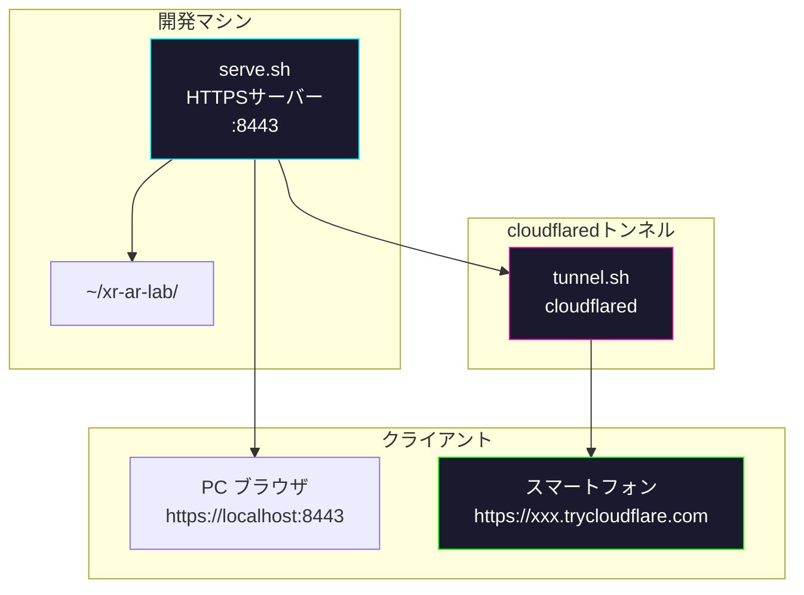
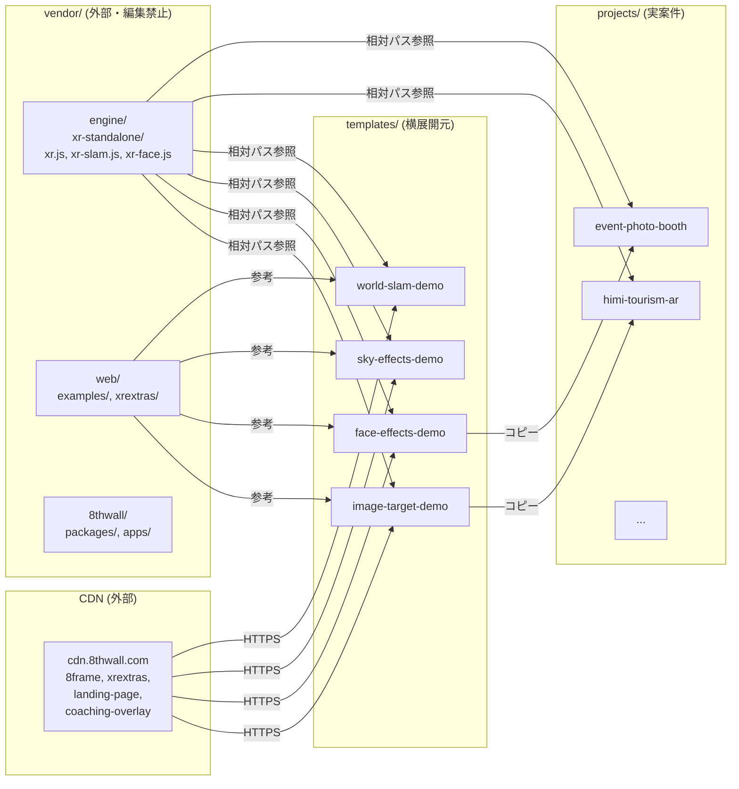
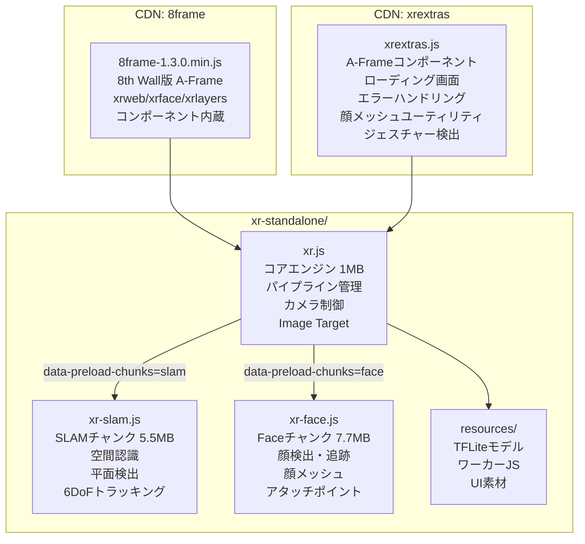
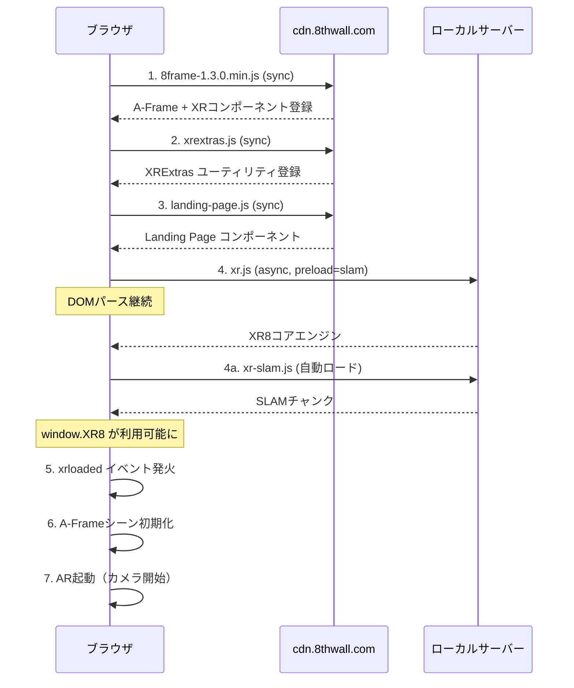
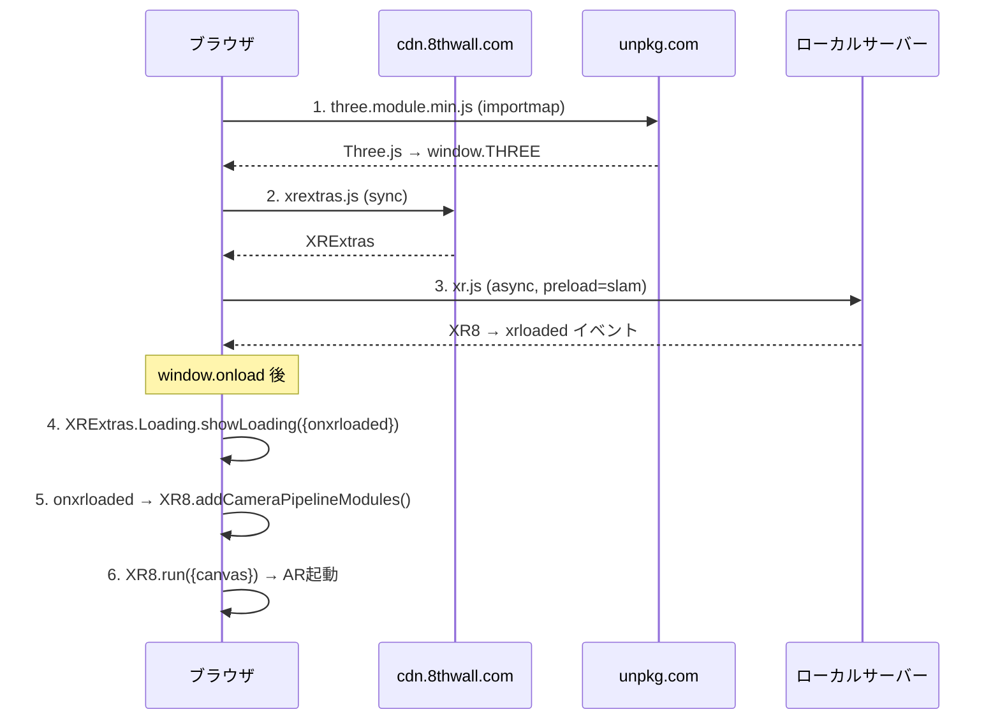
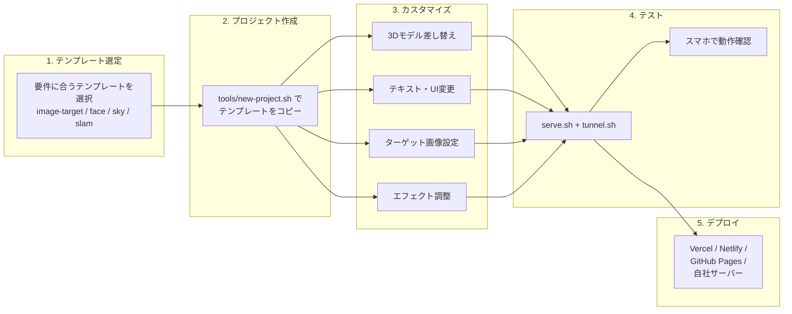

# XR AR Lab アーキテクチャ

## システム構成図



## プロジェクト構成の関係



## 8th Wall エンジンモジュール構成



## スクリプト読み込みフロー

### A-Frame + SLAM（動作確認済みパターン）



### Three.js + SLAM



### Face Effects

```
読み込み順:
8frame (sync) → xrextras (sync) → landing-page (sync) → xr.js (async, preload=face)

シーン設定:
<a-scene xrface="allowedDevices: any">  ← xrweb ではなく xrface
```

### Sky Effects

```
読み込み順:
8frame (sync) → xrextras (sync) → landing-page (sync) → coaching-overlay (sync)
→ xr.js (async, preload=slam) → sky-recenter.js (sync)

シーン設定:
<a-scene xrlayers>  ← xrweb ではなく xrlayers
```

## テンプレートから案件プロジェクトへの横展開フロー



## ファイル相対パス関係

テンプレートとvendorの相対パス（サーバールート = `~/xr-ar-lab/`）:

```
~/xr-ar-lab/                          ← サーバールート
├── vendor/engine/xr-standalone/
│   ├── xr.js                         ← エンジンバイナリ
│   ├── xr-slam.js
│   └── xr-face.js
├── templates/
│   └── image-target-demo/
│       └── index.html                ← ../../vendor/engine/xr-standalone/xr.js
├── samples/
│   └── placeground/
│       └── index.html                ← ../../vendor/engine/xr-standalone/xr.js
└── projects/
    └── himi-tourism-ar/
        └── index.html                ← ../../vendor/engine/xr-standalone/xr.js
```

templates/, samples/, projects/ はすべて深さ2なので、
エンジンバイナリへの相対パスは `../../vendor/engine/xr-standalone/xr.js` で統一。
