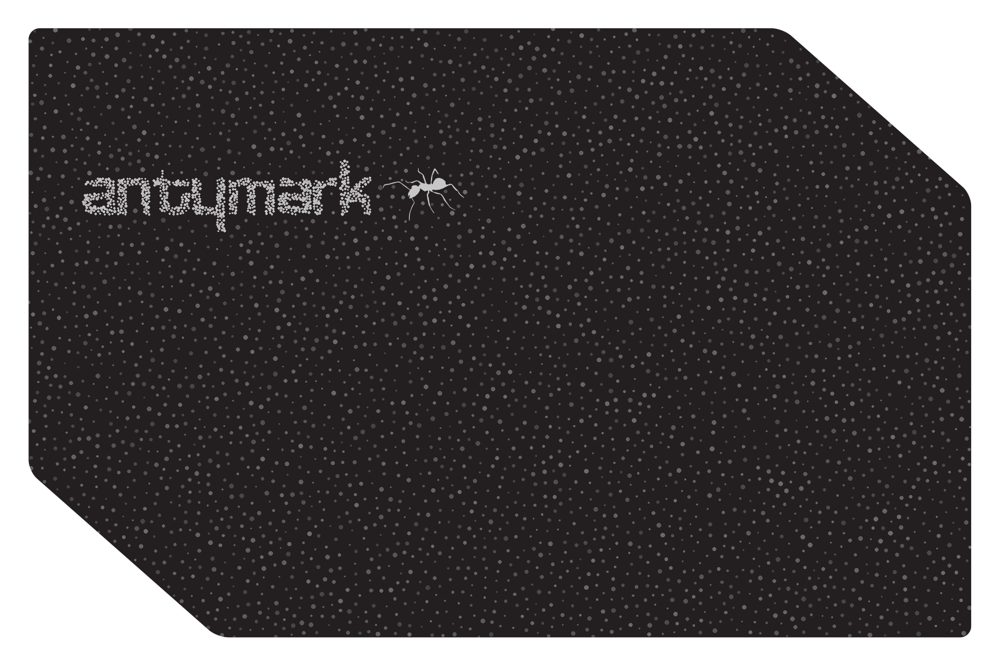
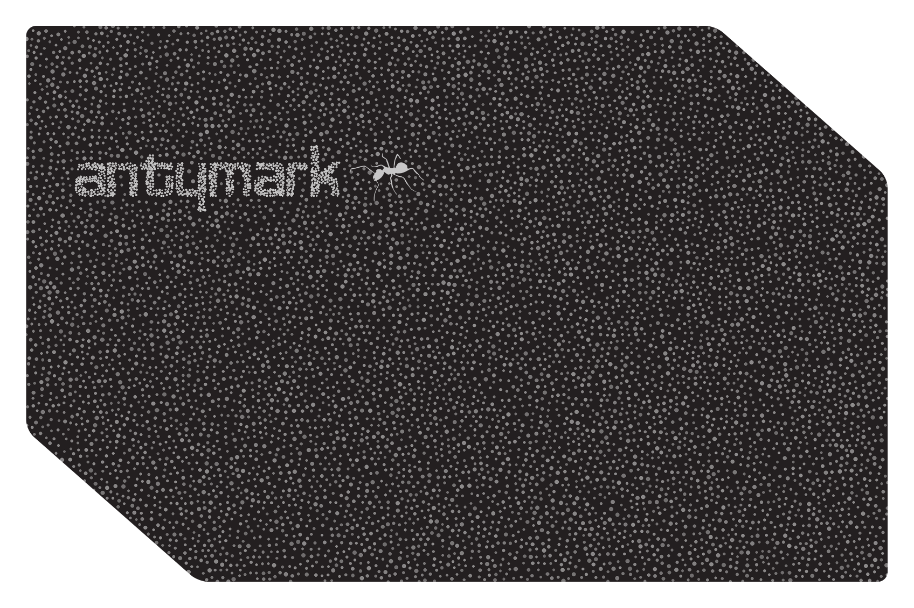
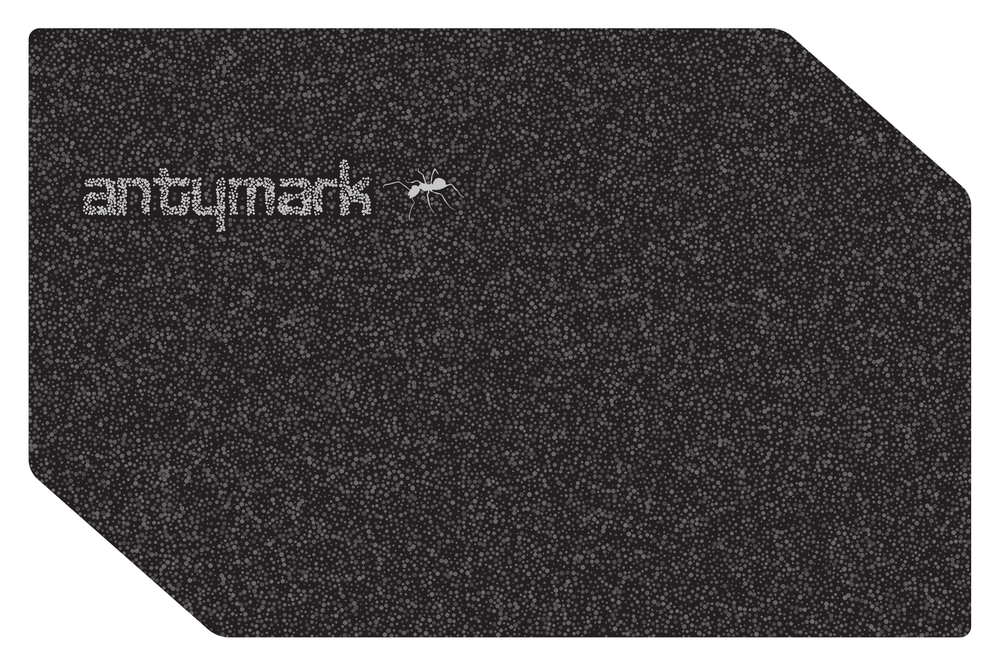

# antymark ショーケース名刺 — 印刷面生成 + AR体験

- リポジトリ: `nao-matsunami/xr-ar-lab` (`~/xr-ar-lab`)
- 作成日: 2026-09-23
- ブランチ: `showcase-card` → `main` にマージ・push 済み
- エンジン: **MIT 版** `engine/mit/xr.js`（`window.__XR_ENGINE_LICENSE = 'mit'`）。バイナリ `lib/xr.js` は不使用
- 前提レポート: [`mit-migration-report.md`](./mit-migration-report.md)

**結果:** 印刷面の生成スクリプトと 3 バリアントの出力、コードから登録する画像ターゲット、
three.js + XR8 の粒子 AR 体験まで通した。ヘッドレスは **コンソールエラー 0 / 外部URL要求 0 /
`cdn.8thwall.com` 要求 0**。粒子の物理はすべてバーテックスシェーダ内の閉じた式で、
CPU は目標座標の配列を差し替えるだけ。

公開URL: **https://nao-matsunami.github.io/xr-ar-lab/showcase/**

---

## 0. 追加・変更したファイル

| パス | 内容 |
|---|---|
| `showcase/print/gen_front.py` | 印刷面の生成スクリプト（Pillow + numpy + cairosvg） |
| `showcase/print/front-print-{sparse,normal,dense}.pdf` | 塗り足し込み 91×61mm / 350dpi / RGB |
| `showcase/print/front-target-{…}.png` | 85×55mm・1024px幅。画像ターゲット登録用 |
| `showcase/print/front-preview-{…}.png` | 確認用（カード 1600px + 白マージン） |
| `showcase/print/front-{print.pdf,target.png,preview.png}` | `normal` の別名コピー（仕様のファイル名） |
| `showcase/ar/particles-{…}.json` / `particles.json` | 粒子の座標・直径・明度（mm, カード左上原点） |
| `showcase/ar/shapes-{…}.json` / `shapes.json` | 目標形状 3 種。**粒子 index 順に並べ替え済み** |
| `showcase/ar/config.js` | しきい値・時間・粒子数などのつまみ |
| `showcase/ar/targets.js` | 画像ターゲットのコード登録 |
| `showcase/ar/particles.js` | GPU ポイント（`THREE.Points` + 自作シェーダ） |
| `showcase/ar/wind.js` / `audio.js` / `tilt.js` / `capture.js` / `ui.js` / `main.js` | 風判定 / 効果音 / 傾き / 録画 / UI / 状態機械 |
| `showcase/index.html` | AR 体験本体 |
| `showcase/demos.html` | **元の `showcase/index.html`（デモ一覧ページ）を改名して退避** |
| `showcase/assets/fish.svg` | ブリのシルエット（自作） |
| `lib/vendor/three/` | three.js r184（MIT）+ LICENSE |
| `tools/headless-check.mjs` | 依存ゼロの CDP ヘッドレス確認ツール |
| `tools/showcase-selftest.html` | XR8 抜きで粒子シェーダと形状を描いて見るページ |
| `.gitignore` | `vendor/` → `/vendor/` に修正、`__pycache__/` を追加 |
| `qr/index.html` / `README.md` | `showcase/` の指す先が変わったことを反映 |

### `showcase/index.html` を置き換えている

仕様は「新規ディレクトリ `showcase/`」だったが、**`showcase/index.html` は初回コミットから
既に存在していた**（XR/AR デモ一覧ページ。`qr/index.html` と `README.md` から参照）。
仕様どおり `showcase/index.html` を AR 体験にし、元のページは **`showcase/demos.html`** に
`git mv` で退避した。`qr/index.html` の "Showcase" は `/showcase/demos.html` に向け直し、
`/showcase/` は "antymark Card" として別エントリで追加してある。中身を捨ててはいない。

### `.gitignore` の `vendor/`

`.gitignore` の `vendor/` は先頭 `/` が無いため **`lib/vendor/` にもマッチ**していた。
既存の `lib/vendor/web/...` は先にコミットされていたので追跡が続いていただけで、
新規に置いた `lib/vendor/three/` は黙って無視される状態だった。
コメントに書かれている意図（リポジトリ直下の 1GB 超の上流クローンを除外する）どおり
`/vendor/` に直した。直下の `vendor/` は引き続き無視される。

---

## Part A：印刷面の生成

### A1. 現行 `card-front.svg` から拾ったもの

`gen_front.py` は SVG をパースして、フラット化済みの 76 パスを分類する。

| | 値 |
|---|---|
| 紙色 | `rgb(13.73%, 12.16%, 12.55%)` = **`#231f20`** |
| インク色 | `rgb(78.43%, 78.04%, 78.14%)` = **`#c8c7c7`**（純白ではない） |
| カード | 240.95 × 155.90 pt = **85.00 × 55.00 mm** |
| ロゴタイプ bbox | (14.17, 34.04)–(87.68, 51.79) pt = 5.00–30.93 × 12.01–18.27 mm、8 パス |
| 蟻 bbox | (90.61, 35.48)–(111.30, 49.32) pt = 31.97–39.27 × 12.52–17.40 mm、1 パス（`fill-rule="evenodd"`） |

分類は「y 帯 33〜53pt に乗っているインク」を取り出し、その中の `evenodd` が蟻・残りがロゴタイプ、
という規則。座標をハードコードしていないので、Nao が Affinity でロゴの位置を動かしても追従する
（位置が y 帯から外れるほど動かした場合は例外を投げて止まる）。

輪郭（右上・左下の斜め落とし）は紙のパスをそのままラスタライズしてマスクに使っている。
`"Visual Projection Unit"` / 氏名 / 肩書 / `antymark.com` の 4 群は落とした。

### A2. 粒子

- 可変半径の**ポアソンディスクサンプリング**（Bridson）。塗り足し込みの 91×61mm 全面に打ってから、
  カード内（斜め落としの内側）だけを `particles.json` に落とす。
- 半径はロゴタイプの内外で切り替える。**`r_in` は 3 バリアントとも 0.20mm で共通**。
  ここをバリアントごとに変えると「どの密度が認識に強いか」ではなく
  「どの密度だとロゴが読めるか」の比較になってしまうため。
- ロゴタイプの外周 0.45mm に**一段疎な隙間（halo, 半径 = `r_out` × 2.1）**を作ってある。
  これが無いと字が地のノイズに溶ける。halo は logo マスクの**外側**にしか作らないので
  ステム（幅 0.9mm 前後）は削られない。
- 粒子径は 0.15〜0.40mm の範囲で点ごとに変える。外側は平均 0.265 / σ 0.085 と**ばらつきを大きく**取った。
  径が一定だと画像が一様な高周波ノイズになり、カメラ側で縮小されたときに特徴が潰れる。
  複数スケールの塊を作ることで繰り返し感も消える。
- 蟻マークは実線のまま合成し、その上（+0.09mm 外周）には粒子を置かない。

| variant | `r_out` | `r_in` | ページ全体 | カード内粒子 | うちロゴ内 |
|---|---|---|---|---|---|
| sparse | 0.80 mm | 0.20 mm | 6,206 | **5,013** | 824 |
| normal | 0.55 mm | 0.20 mm | 11,901 | **9,510** | 850 |
| dense | 0.37 mm | 0.20 mm | 25,387 | **20,118** | 871 |

いずれも AR 側の上限 30,000 に収まっている。乱数シードは `--seed`（既定 20260923）で固定。

### A3. 出力の実測値

| | 実測 |
|---|---|
| `front-print-*.pdf` | MediaBox 257.97 × 173.01 pt = **91.00 × 61.03 mm**、1254 × 841 px @ 350dpi、`/DeviceRGB`（CMYK 変換なし）、トンボなし |
| `front-target-*.png` | **1024 × 663 px**（85×55mm 比） |
| `front-preview-*.png` | カード 1600px 幅 + 白マージン 48px |

61.00 ではなく 61.03mm なのは 61mm × 350dpi = 840.55px を 841px に丸めているため（+0.03mm、塗り足しの内側）。
断裁位置に影響しない範囲なのでそのままにしてある。

### A4. preview と、ロゴが読めるかの自己評価

**sparse**



**normal**



**dense**



**自己評価: 3 バリアントとも「antymark」は密度差だけで読める。ベタ塗りにはなっていない。**

- 決め手は **halo（字の周りの 0.45mm の隙間）**と、内外の粒子径を逆転させたこと
  （内側 = 細かく明るい 0.20mm / 外側 = 粗く暗い 0.265mm 平均）。
  面積被覆率で内側 : 外側 ≈ 0.38 : 0.13、明度を掛けた実効コントラストで約 7:1。
- 初回は読めなかった。潰れていた原因は 2 つで、どちらも直してある:
  1. `r_in` を `r_out` に比例させていたため sparse でステムに点が 1〜2 列しか入らなかった → `r_in` を直接指定に変更
  2. halo を 0.55mm にしたら字そのものを削ってしまった → 0.30mm まで戻し、最終的に 0.45mm + 半径 2.1 倍に調整
- **限界の断り**: 判定は preview（実寸の約 2.3 倍）で行っている。印刷実寸ではロゴタイプは幅 26mm・
  ステム 0.9mm・点 0.20mm なので、**読めるが繊細**。紙とインクの滲みが大きいと内側が潰れて
  ベタに寄る可能性がある。試し刷りで潰れたら `DIA_IN_MEAN` を 0.18 に落とすか `r_in` を 0.22 に戻す。

---

## Part B：画像ターゲットの登録（クラウド不要）

`vendor/8thwall/` の上流ソースで現行 API を確認した。

- `XR8.XrController.configure({imageTargetData: [...]})`
  （`reality/app/xr/js/src/tracking-controller.ts` の `configure` → `setActiveImageTargets`）
- 要素の型は `reality/shared/engine/image-targets.ts` の `ImageTargetData`:
  `{imagePath, metadata, moveable, name, physicalWidthInMeters, type, properties}`
- `imagePath` は `loadRemoteImageUrl()` が `` として読むだけ。**ローカルの PNG をそのまま渡せる**。
  8thwall.com のプロジェクトにアップロードする必要はない。
- `physicalWidthInMeters` は `type: 'PLANAR'` のときだけエンジンに渡る（`extractTargetMetadata`）。
  **`0.085`（85mm）を明示**してある。高さ 55mm は `properties` の 1024×663px のアスペクト比から決まる。

`showcase/ar/targets.js` が 3 バリアントを `antymark-card-sparse` / `-normal` / `-dense` で登録する。
登録時に全 3 件を、認識時にどれを掴んだかを、それぞれコンソールへ出す。

```
[showcase] image targets registered: antymark-card-sparse (1024x663px, 85x55mm), antymark-card-normal (…), antymark-card-dense (…)
[showcase] target found: antymark-card-normal (variant=normal) after 4.12s
[showcase] variant "normal" attached: 9510 particles (json 9510, cap 30000)
```

`after N.NNs` はページ読み込みからの経過なので、**3 枚を順に見せれば「どれが一番早く掴むか」が
そのまま数字で出る**。2 枚目以降が同時に視界に入った場合は `[showcase] also visible: …` を出すだけで、
最初に掴んだバリアントを使い続ける。

### `disableWorldTracking` について

`XR8.XrController.configure({disableWorldTracking: true})` は渡しているが、
**MIT ビルドではそもそも SLAM が入っていない**（`engine/mit/README.md`）ため実質的に無効化済みの状態。
A-Frame 版の `xrweb="disableWorldTracking: true"` と同じ経路なので、渡して害はない。

---

## Part C：AR 体験

### C0. 構成

- **A-Frame は使っていない。** `XR8.Threejs` の three.js パイプラインに直接乗せている。
- three.js は **`lib/vendor/three/three.module.min.js`（r184, MIT）**。importmap で `"three"` に解決。
  `lib/vendor/` にも `demos/print-shop/card-demo` にも独立した three.js は無く（card-demo は 8frame 同梱の
  THREE を使っている）、CDN からの取得は環境のネットワーク制限で不可だったため、
  同一マシン上の npm パッケージ（`three@0.184.0`, MIT）から `three.module.min.js` /
  `three.core.min.js` / `LICENSE` をコピーしてベンダリングした。
- `xrextras.js` は**ローカル同梱版**から `FullWindowCanvas` だけ使う（キャンバスをビデオの
  アスペクトに合わせて画面いっぱいに保つ処理）。ローディング UI は仕様どおり自前の点ひとつ。
- **外部 URL はゼロ。** フォントも使っていない（UI は絵文字グリフのみ）。

### C1. 呼吸

- カードは **単色の `PlaneGeometry`（85×55mm, `#231f20`）**で覆う。Canvas テクスチャは使っていない。
- 点群は `particles-<variant>.json` の座標・明度そのまま。板の 0.2mm 手前に乗る。
- 揺れは振幅 0.3mm、周期 2〜4 秒、位相は点ごとにランダム。
- 傾けると点群全体が 0.5mm だけ低い側に寄る（C3 の暗黙のチュートリアル）。`TILT.biasMm`。

### C2. 吹く → 散る → 再形成

- 風判定は `AnalyserNode` の時間領域 RMS が閾値を **150ms 以上連続**で越え、**かつ 150Hz 以下の帯域が
  全体パワーの 55% 以上**のとき。後者が無いと会話・拍手で誤爆する。
  閾値・持続・帯域比は `config.js` の `WIND`。
- マイク許可・WebAudio の `resume()`・iOS の `DeviceMotionEvent.requestPermission()` は
  **認識後の最初のタップ**でまとめて要求する。iOS は DeviceMotion の許可要求がユーザー操作の
  有効期限内である必要があるため、`await` を挟む前に投げている。
- 許可前は 🌬 を薄く表示、許可されたら消す。**拒否された場合はカードの長押し 500ms** で同じ風イベント。
- 散る: 紙面法線 +z 方向に横方向のばらつきを足した向きへ、風の強さに比例した初速。空気抵抗つき。
- 再形成: 風が止んで 1.5 秒後、`easeOutCubic` で 2.5 秒、点ごとに 0〜0.5 秒の遅延。
- 形状の循環: `logotype` → `fish` → `logotype` → `ant` → …（`REFORM.cycle`）。
- 形状の配置は**カード中央**に、ロゴタイプ 70×16.9mm / 魚 70×32.2mm / 蟻 44×29.4mm。
  印刷時の静止状態（= ロゴが密度差で読める状態）とは別物として、大きく組み直して見せている。
- **蟻の脚**は、マスクを 9px（0.56mm）収縮させて「本体」を作り、そこから外れた点（= 脚・触角）に
  0.62〜1.00 の遅延を、本体の点に 0.00〜0.28 の遅延を割り当てている。脚が最後に伸びる。
- 音はすべて WebAudio 生成。散る瞬間はホワイトノイズ → バンドパス 2〜6kHz を掃引 → 短いエンベロープ、
  音量は風の強さ比例。再形成完了時はフィルタスイープ 1 つ。🔊/🔇 でミュート。

#### 形状 → 点の対応

各形状の SVG をラスタライズしてポアソンディスクで**粒子と同数** N 点サンプルし、
**最近傍の貪欲割当**（グリッドのリングを外へ広げながら未使用の最近傍を取る。余った src には
残りを配る）で対応を付ける。hungarian は使っていない。これを `shapes-<variant>.json` に
**粒子 index 順に並べ替えて**焼いてあるので、実行時は `Float32Array` をそのまま属性に流すだけ。

### C3. 傾ける

- `DeviceMotionEvent.accelerationIncludingGravity` から端末座標の「下」を作り、画面の回転を打ち消し、
  カメラのワールド姿勢 → カードのワールド姿勢の逆、でカード平面内の重力成分に落とす。
- **取れない端末ではカメラ座標系の下方向 (0,−1,0) を代用**する（仕様どおり）。同じ経路を通るので
  分岐はベクトル 1 本の差し替えだけ。
- 閾値を越えると低い側へ滑る。摩擦は点ごとの乱数で 0〜45% 滑り量を減らす。水平に戻せば式が 0 に戻るので
  元の位置へ戻る。
- **縁に溜まるのはクランプそのもの。** 滑った先をカード矩形にクランプしているので、押し出された点が
  縁に積み上がる。
- 傾き 40° 超で縁からこぼれて落下。こぼれ判定には**こぼれ始めた瞬間の重力をラッチした値**を使う
  （現在値で判定すると、戻し始めた瞬間に判定が消えて点が瞬間移動してしまう）。
- 水平に戻すと 2 秒待ってから縁の外 14mm から `easeOutCubic` で湧いて戻る。待っている間は α=0。
- 傾け中に風が来たら風が優先（シェーダの傾き処理は BREATHE ブランチの中だけ。加えて風の開始時に
  こぼれ状態を畳む）。

### C4. 撮影

`⏺` で 5 秒録画。`canvas.captureStream(30)` に WebAudio の `MediaStreamDestination` を混ぜて
`MediaRecorder` に流し、`mp4` が使えれば mp4、無ければ webm で保存する。録画中は ⏺ が赤く脈動。

### C5. 2 枚目 — **未実装**

同じターゲットが 2 枚見えたときの「点の橋」は実装していない。
理由は、いまの設計が「1 枚のカードローカル mm 空間」に閉じているのに対し、橋は
2 つのターゲット姿勢をまたぐ共通空間と、点をどちらのカードに属させるかの所属管理が要り、
シェーダの構成（`aA`/`aB` の ping-pong）ごと作り直しになるため。
現状は 2 枚目を認識したら `[showcase] also visible: …` を出すだけで無視する。

### 性能

- 直近 60 フレームの平均 fps が **25 未満のまま 3 秒**続いたら、`geometry.setDrawRange()` で
  描画点数を半分（下限 15,000）に落とす。**復帰はしない。** 落としたことはコンソールに出す。
  `particles.json` は生成時にシャッフルしてあるので、先頭半分だけ描いても全面に散る。
- 位置の補間・散る軌道・滑り・こぼれは**すべてバーテックスシェーダ内の閉じた式**。
  空気抵抗つきの弾道も `(1 - exp(-kt))/k` で解析的に書けるので CPU で積分していない。
  CPU がやるのは「再形成のたびに目標座標の配列を差し替える」ことと uniform の書き込みだけ。
- 落ち着き先は `aA` / `aB` の 2 本を **ping-pong** させる。再形成が終わったら uniform の
  `uSrc` を反転するだけで、配列のコピーは一度も起きない。

---

## Part D：確認

### D1. ヘッドレス

`tools/headless-check.mjs`（依存パッケージなし。Node 22 の組み込み WebSocket で CDP を直接叩く）。

```
node tools/headless-check.mjs http://127.0.0.1:8811/showcase/ --wait 14000 \
  --eval "typeof XR8" --eval "window.__XR_ENGINE_LICENSE" --eval "window.THREE.REVISION"
```

| 項目 | 結果 |
|---|---|
| ページ読み込み | OK |
| `typeof XR8` | `object` ✅ |
| `XR8.XrController` / `XR8.Threejs` | どちらも `object` ✅ |
| `window.__XR_ENGINE_LICENSE` | `'mit'` ✅ |
| `window.THREE.REVISION` | `'184'` ✅ |
| ⓘ 帰属ボタン | DOM に存在 ✅ |
| UI アイコン | `sc-rec, sc-sound, sc-blow` + ⓘ の 4 つ ✅ |
| **コンソールエラー** | **0** ✅ |
| **`cdn.8thwall.com` 要求** | **0** ✅ |
| **外部 URL 要求** | **0**（全 18 要求が同一オリジン）✅ |

### D2. 粒子シェーダの確認（カメラ無しでは XR8 が走らないため別建て）

ヘッドレス Chrome にはカメラが無く `XR8.run()` が起動しない（前回の MIT 移行レポートと同じ制限）。
そこで `tools/showcase-selftest.html` で XR8 抜きに `showcase/ar/particles.js` を素の three.js で
動かし、6 状態を 1 枚に描いて確認した。

| variant | 粒子数 | `gl.getError()` | シェーダのコンパイル |
|---|---|---|---|
| sparse | 5,013 | 0 | ok |
| normal | 9,510 | 0 | ok |
| dense | 20,118 | 0 | ok |

描いた 6 状態は「印刷どおりの静止」「傾けて縁に溜まる」「散る t=0.45s」「再形成 logotype」
「再形成 fish」「再形成 ant」で、いずれも意図どおりだった。

この確認で**バグを 1 件見つけて直した**。Bridson のポアソンディスクは種を置いた連結成分しか
埋められないため、ロゴタイプのように**字が 8 個に分かれたマスク**では 1 文字目しかサンプルされず、
`shapes.json` の `logotype` が「a」1 文字だけになっていた。`active` が枯れたら別の場所に種を
蒔き直す処理を入れて全成分を埋めるようにしてある（`poisson_disk` の `reseed`）。
魚と蟻は連結なので影響を受けておらず、**セルフテストの画で見なければ気付けなかった**。

### D3. Nao の実機確認項目

URL: **https://nao-matsunami.github.io/xr-ar-lab/showcase/**

1. **どのバリアントが最短で認識するか** — Mac で `showcase/print/front-preview-{sparse,normal,dense}.png`
   を順に画面表示し、Pixel 7 で向ける。Chrome の `chrome://inspect` でコンソールを見ると
   `[showcase] target found: antymark-card-XXX (variant=XXX) after N.NNs` が出る。3 枚の N を比べる。
   （画面表示ではなく実際に刷った紙で比べるのが本命。その場合は `front-print-*.pdf` を Affinity で
   CMYK 変換して出力）
2. **呼吸が見えるか** — 認識直後、飛ばずに点がゆっくり揺れているか。振幅 0.3mm なので近寄らないと分からない想定。
3. **吹いて散るか** — 一度タップしてマイクを許可してから、カードに息を吹きかける。
   🌬 が消えていれば許可は通っている。
4. **話し声で誤爆しないか** — カードを見ながら普通に喋る。散ったら `config.js` の
   `WIND.lowBandRatio` を上げる（0.55 → 0.65）か `rmsThreshold` を上げる。
5. **傾けて滑るか** — カードを寝かせた状態から手前・奥に傾ける。低い側へ点が寄り、縁に溜まるか。
6. **40° でこぼれるか** — さらに傾ける。縁から落ちて画面外へ消え、水平に戻すと 2 秒後に縁から湧いて戻るか。
7. **⏺ で保存されるか** — 5 秒録画してカメラロール／ダウンロードに残るか。拡張子は端末により mp4 / webm。
8. **fps** — 重かったらコンソールに `[showcase] fps … -> particles reduced to …` が出る。
   出るようなら `dense` は避けて `normal` か `sparse` を選ぶ。

マイクを拒否した場合は **カードを 500ms 長押し**で風が起きる。これも一度試してほしい。

---

## 未実装・残課題

| 項目 | 状況 |
|---|---|
| C5 2 枚目の橋 | **未実装**（上記 C5 の理由）。2 枚目は無視してログに出すだけ |
| カード縁のクランプ | 斜め落とし（右上・左下）ではなく**矩形**でクランプしている。斜めの辺では 0〜数 mm 内側で止まる |
| 裏面 | 今回は表面のみ。`showcase/assets/card-back.svg` は触っていない |
| CMYK 変換 | 仕様どおり **していない**。RGB の PDF を出すところまで |
| `particles.json` / `shapes.json`（接尾辞なし） | 仕様のファイル名として `normal` のコピーを置いてあるが、実行時は `-<variant>` 付きの方を読む |

---

## 追記 2026-10-06：占有板の位置ずれと、傾きの基準

実機で出ていた 2 件を直した。

1. **黒い占有板が名刺に重ならず、縦長で数倍大きく宙に浮く**
2. **認識した瞬間から点が片側に寄っている**（傾きを絶対角で見ていたため）

### E1. 原因：`scale` の意味の取り違えと、エンジンが返す軸の 90° ずれ

**実測で確かめた。** ヘッドレス Chrome に、名刺の PNG を合成した y4m を偽カメラとして流し
（`--use-file-for-fake-video-capture`）、`?anydevice` 付きで `XR8.run` を回した。
MIT エンジンが実際に返した `reality.imagefound` の `detail` は次のとおり
（正面・面内 12° 回転で写したもの）：

```
position  {x: -0.00003, y: 1.99873, z: -0.96730}
rotation  {x: 0.0006, y: 0.0004, z: -0.1045, w: -0.9945}   ← Z 回り 12°
scale     0.6318985
scaledWidth 1.5444947   scaledHeight 1
```

| 量 | ドキュメント / 旧コードの想定 | 実際（実測とエンジンのソース） |
|---|---|---|
| `scale` | ターゲットの物理サイズ（m） | `max(widthInMeters, heightInMeters)`（`tracking-controller.ts:716`）。中身はエンジン内部の任意単位で、**名刺の長辺のワールド長**。写る大きさを変えても 0.6319 のまま変わらず、遠近は `position` の距離に出る（330px 幅で z=−0.968、400px 幅で z=−0.798） |
| `scaledWidth` / `scaledHeight` | `× scale` でシーン上の幅・高さ | `properties.width/height` から作るアスペクト比 1.544 / 1（`:923`）。**`× scale` しても実寸にならない**（幅が 1.544 倍に膨らむ） |
| `physicalWidthInMeters` | 85mm を伝えている | JS のメタデータには載るが、**C++ 側は一切読んでいない**（`reality/engine` 以下に参照ゼロ）。メートル単位にはならない |
| 姿勢の軸 | ローカル +X = 名刺の横（85mm） | 横長画像はエンジン内で **90° 回して縦長として読まれる**（`detection-image-loader.cc` の `rotation_ = width > height ? 90 : 0`）。返る姿勢もその縦長画像の軸なので、**+X = 短辺（55mm）、+Y = 長辺（85mm）** |

旧コードは `root.scale = detail.scale * scaledHeight / 55` としていた。これは「`scale × scaledHeight` が
高さ 55mm」とみなす計算で、mm あたりの倍率は正しい値（`scale / 85`）の **85/55 = 1.545 倍**だった。
しかも 85mm の辺をローカル X（実際は名刺の短辺方向）に置いていたので、板は 90° 回って**縦長**になる。
そのため画面上では、名刺の短辺方向に 85×1.545 = 131mm 相当、長辺方向に 55×1.545 = 85mm 相当の板が出ていた。
名刺の短辺に対しては 131/55 ≒ **2.4 倍**になり、「縦長で数倍大きい」という症状はこれで説明がつく。
宙に浮いて見えたのも同じ原因で、外にはみ出した部分は名刺の上に重なる場所が無いので浮いて見えていた
（中心の位置と距離は正しかった）。

旧コードのまま偽カメラで撮った画面では、板が画面全体を覆い、名刺はまったく見えなかった。
倍率だけ `scale / 85` に直して板を半透明にすると、大きさは合うものの、名刺に対して直角に回った板が
上下にはみ出していた。これで残りの原因が軸の 90° ずれだと切り分けられた。

### E2. 修正

- `targets.js` に `cardPoseFromDetail(detail)` を追加。
  - `mmToWorld = detail.scale / 85`（長辺 85mm を `scale` に合わせる）
  - `roll = −90°`（`scaledWidth > scaledHeight`、つまり横長 PNG のとき）
  - `aspectRatio`：画像アスペクトと 85/55 の比（実測 0.999。663px の丸め分）。ログに出す
- `main.js`：`root`（ターゲット姿勢 + `mmToWorld`）の子に `card` グループ（`rotation.z = roll`）を挟み、
  **板と点群はカードローカル mm（x 右・y 上）のまま `card` に付ける**。
  `particles.js` の座標系（左上原点 mm → 中心原点 mm、`PlaneGeometry(85, 55)`）は元から正しかったので、
  形状の変更は不要。`uWorldScale`（点の見かけの大きさ）は `root.scale.x` のままで正しい値になる
- 認識時に `[showcase] pose: scale=… scaled=…x… -> mm=… world, roll=-90deg, aspect=…` をログに出す
- `?debug`：板を半透明の赤にし、名刺の左上に黄色の目印を出す。実機で重なりを見る用
- `?anydevice`：`allowedDevices: ANY` で `XR8.run`。デスクトップ（ヘッドレス + 偽カメラ）検証用
- `tools/headless-check.mjs`：`CHROME_EXTRA_ARGS` で Chrome に引数を足せるようにした（偽カメラの映像を指定するため）

修正後、名刺の左上に赤い目印を付けた映像に `?debug` を重ねると、**黄色の目印が赤い目印にぴったり乗り**、
外形も一致した（正面 0° と面内 12° の両方）。点群も、印刷された点の上にそのまま重なる
（ロゴタイプも斜めに欠けた角も一致）。

### E3. 傾きを「認識時の姿勢からの相対角」に

旧 `tilt.js` は、「下」をカードローカルに引き戻した `downCard.xy` をそのまま面内重力にしていた。
DeviceMotion が無いとき（許可前は常にそう）は「下」の代わりに**画面の下方向**を使うので、
名刺を斜めから覗いて認識しただけで、もう傾いていると判定される。偽カメラで正面から撮った場合でも、
認識直後から点が下側へ滑り、縁に溜まっていた。

新しい `tilt.js` は次のように動く：

- `resetBase()` を呼ぶと、次の `update()` の「下」（カードローカル）を基準として覚える
  （基準を −Z に回す四元数 `_baseQ` を作る）
- 以降は `downCard = _baseQ · downLocal`。基準姿勢のままなら `(0, 0, −1)` なので、**面内重力は 0**
- `degrees` は基準との角度差。こぼれ判定（`spillDeg` 40°）はこの相対角で行う
- `TILT.deadzoneDeg = 4`（`config.js`）：これ以下はトラッキングの揺れとみなして重力 0。
  4° を越えた分を `sin` で面内重力の大きさにする（`TILT.biasMm` によるわずかな寄りも、静止時には出ない）
- 基準を取り直すタイミング：
  - **`reality.imagefound` のたび**（見失ってから再認識した場合を含む）
  - root が非表示から表示に変わった最初の更新。最初の `imagefound` は点群の読み込みに使われていて、
    その時点ではまだ root が無いので、こちらで拾う
  - 「下」の情報源が切り替わったとき（最初のタップで DeviceMotion の許可が下りた瞬間）
- `tilt.update()` は状態に関係なく毎フレーム回す（散っている最中に再認識しても、その瞬間の姿勢が基準になる）。
  面内重力を点群に渡すのは従来どおり `BREATHE` 中だけ
- こぼれた点が落ちていく向き（`uSpillDown`）は、相対ではなく今の実際の「下」（`downLocal`）を使う

偽カメラの実ページでは、認識後 `tilt.degrees = 0.07°`、状態は `BREATHE` で、点は印刷位置に留まっている。

### E4. `tools/showcase-selftest.html` での確認

既存の 6 タイルに 2 タイルと数値チェックを足した。3 バリアントとも `ok: true`、
コンソールエラー 0、外部 URL 0。

| チェック | 内容 | 結果 |
|---|---|---|
| `pose` | 実測の `detail` → `root`/`card` → 名刺の 4 隅。長辺 = `scale`（0.6319）、短辺 = `scale × 55/85`（0.4089）、カード左上がエンジン軸で (+27.5, +42.5) | 全部一致 |
| `tilt.atFound` | 斜め 35° で認識（旧実装の絶対角だと 56.8° 傾いていると判定される姿勢） | 0°、重力 (0, 0) |
| `tilt.jitter3deg` | そこから 3° | 重力 0（デッドゾーン内） |
| `tilt.tilt25` | 25° 傾ける | 25.00°、面内重力 = sin 21° |
| `tilt.tilt50` | 50° | 50.00°、こぼれ判定 on |
| `tilt.refound` | 50° のまま `resetBase()`（再認識） | 0° に戻る |
| `tilt.backToOld` | 再認識後に元の姿勢へ | 今度はそちらが 50° |
| `tilt.sourceSwitch` | DeviceMotion に切り替わる | 0° で取り直し |
| `restPixelsDiff` | 「35° で認識直後」のタイルと、同じ位置に描いた印刷どおりの静止 | **0 バイト差**（同一の画） |
| `tiltPixelsDiff` | 相対 25° のタイル | 差あり（滑っている） |

確認コマンド（偽カメラの y4m は、`front-target-normal.png` を灰色の背景に置いた 640×480 の静止画を
`ffmpeg -loop 1 -i frame.png -t 4 -r 30 -pix_fmt yuv420p card.y4m` で動画にしたもの）：

```bash
node tools/headless-check.mjs "http://127.0.0.1:8811/tools/showcase-selftest.html?variant=normal" \
  --wait 9000 --eval "JSON.stringify(window.__selftest.checks)"
CHROME_EXTRA_ARGS="--use-file-for-fake-video-capture=/tmp/card.y4m" \
  node tools/headless-check.mjs "http://127.0.0.1:8811/showcase/?anydevice&debug" \
  --wait 22000 --screenshot /tmp/overlay.png --eval "window.__showcase.tilt.degrees"
```

### E5. 実機でまだ見ていないこと

- 偽カメラはデスクトップ（`allowedDevices: ANY`）での確認。**Pixel 7 での見た目は未確認**。
  `scale` と軸の性質はエンジン（`detection-image-loader.cc` / `tracking-controller.ts`）の処理から決まり、
  端末には依存しないはずだが、念のため https://nao-matsunami.github.io/xr-ar-lab/showcase/?debug
  で、赤い板が名刺にぴったり重なり、黄色の目印が名刺の左上に来ることを見てほしい。
  コンソールには `[showcase] pose: … roll=-90deg, aspect=0.999` が出る
- DeviceMotion を使った場合の傾きの向き（端末座標 → カメラ座標の対応）は、相対化しても残る誤差がありうる。
  手前に傾けて手前に滑るかを見る（D3 の 5・6 番）

---

## 再生成の手順

```bash
python3 -m venv ~/.venvs/showcase
~/.venvs/showcase/bin/pip install cairosvg pillow numpy

cd ~/xr-ar-lab
~/.venvs/showcase/bin/python showcase/print/gen_front.py              # 3 バリアント全部（約 5 分）
~/.venvs/showcase/bin/python showcase/print/gen_front.py --variant dense --seed 12345
```

確認:

```bash
python3 -m http.server 8811 --bind 127.0.0.1 &
node tools/headless-check.mjs http://127.0.0.1:8811/showcase/ --wait 14000 --eval "typeof XR8"
node tools/headless-check.mjs "http://127.0.0.1:8811/tools/showcase-selftest.html?variant=dense" \
  --wait 9000 --screenshot /tmp/selftest.png --eval "JSON.stringify(window.__selftest)"
```

---

## `git log --oneline -10 main`

```
c51e8df Merge showcase-card: antymark 名刺の印刷面生成と粒子AR
5d81c49 Add antymark showcase card: print-face generator and particle AR
8501788 Mark the quick-tunnel test section superseded by GitHub Pages
96c3dba Add MIT migration and bugfix report
74207e7 Fix card-demo object switcher and gate audience SE behind a user gesture
2a187f0 Fix buri-slam-demo gestures: drag rotates instead of placing, pinch scales
8bf9f82 Switch image-target/face/sky demos to MIT engine (SLAM demos stay on binary)
a76ef81 Remove 8i-hologram sample (unrecoverable external deps)
325a972 Re-establish test tunnel, fix same autoupdate bug in tools/tunnel.sh
cd63ffa Update test tunnel URL after cloudflared autoupdate killed the old one
```
